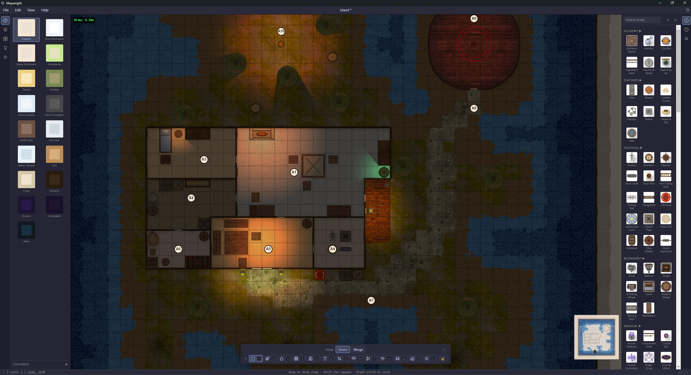
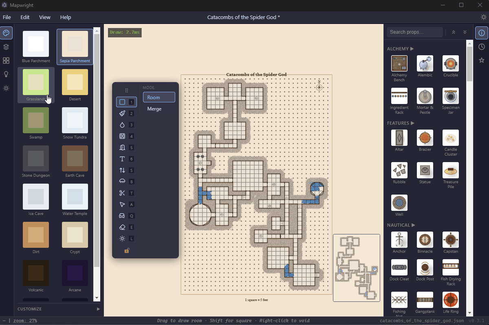

# Mapwright

> AI-powered dungeon map editor for D&D 5e. Describe a dungeon, get a polished map — or draw it yourself in the browser.


[](https://github.com/sponsors/LeoMelnyk)

[**Download for Windows →**](https://github.com/LeoMelnyk/Mapwright/releases)
[**Download for Mac →**](https://github.com/LeoMelnyk/Mapwright/releases)

---


---

Mapwright is a dungeon map editor built around two workflows:

- **Draw in the visual editor** — 14 tools, full undo/redo, pan/zoom, multi-level support
- **Let Claude do it** — a full Puppeteer bridge and `planBrief` command so Claude can plan, layout, and render complete maps without touching the GUI

Both workflows produce the same output: a polished, themed map ready to drop into your session.

---

## Download

### Standalone Desktop Apps

No Node.js or terminal required.

| Platform | Download | Notes |
|---|---|---|
| **Windows** | [`Mapwright.exe`](https://github.com/LeoMelnyk/Mapwright/releases) | Portable — no installer, just run it |
| **Mac** | [`Mapwright.dmg`](https://github.com/LeoMelnyk/Mapwright/releases) | Signed & notarized — double-click to install |

On first launch, the built-in texture downloader will run. Download textures once and they persist across sessions.

### From Source

Requires [Node.js](https://nodejs.org/) 18+.

```bash
git clone https://github.com/LeoMelnyk/Mapwright.git
cd Mapwright
npm install
npm start
```

Open **http://localhost:3000/editor/** in your browser. Run `npm run electron` to open in a desktop window instead.

---

## Two Ways to Make Maps

### 1. Visual Editor



Start the server (`npm start`) and open **http://localhost:3000/editor/**.

**14 tools:** Room · Paint · Wall · Door · Label · Stairs · Trim · Select · Prop · Light · Fill · Erase · Range · Bridge

Full undo/redo, pan/zoom, multi-level dungeons, and JSON save/load.

---

### 2. AI Generation with Claude

Two interfaces for programmatic map creation:

**`planBrief` — describe rooms, Claude computes the layout:**

```js
// Tell Claude what you want in plain language.
// planBrief returns ready-to-execute editor commands — no coordinate math required.
planBrief({
  rooms: [
    { id: "A", name: "Entry Hall", size: "small", description: "Guard post" },
    { id: "B", name: "Main Chamber", size: "large", description: "Throne room" },
  ],
  connections: [["A", "B", "door"]]
})
```

**Puppeteer bridge — full headless editor control:**

```bash
node tools/puppeteer-bridge.js \
  --commands '[["newMap","Dungeon",20,30],["createRoom",2,2,8,12]]' \
  --screenshot output.png \
  --save output.json
```

70+ editor API methods documented in [`src/editor/CLAUDE.md`](src/editor/CLAUDE.md).

---

## Themes

16 visual themes, each with unique wall colors, floor textures, and rendering style.



| Theme | Best For |
|---|---|
| `stone-dungeon` | Crypts, tombs, underground fortresses |
| `crypt` | Dark stone crypts, undead lairs |
| `earth-cave` | Natural caves, mines, burrows |
| `ice-cave` | Frozen environments, winter dungeons |
| `water-temple` | Aquatic environments, flooded ruins |
| `underdark` | Deep underground, Underdark passages |
| `volcanic` | Lava caves, fire-themed dungeons |
| `swamp` | Bog ruins, murky environments |
| `desert` | Arid ruins, sand-buried dungeons |
| `dirt` | Earthen burrows, rough tunnels |
| `grasslands` | Outdoor overworld, surface maps |
| `snow-tundra` | Arctic overworld, frozen wastes |
| `arcane` | Wizard towers, magical environments |
| `alien` | Sci-fi, aberrant, Far Realm |
| `blue-parchment` | Clean architectural style, general purpose |
| `sepia-parchment` | Aged/historical feel, classic module aesthetic |

Individual theme colors can be customized in the editor's theme editor panel.

---

## DM Player View


Mapwright includes a real-time fog-of-war player view via WebSocket. Open the **Player View** on a second screen or player-facing display, then reveal cells from the DM view. Revealed cells are broadcast live — no third-party VTT required.

- DM sees a semi-transparent fog overlay showing what players can and can't see
- Players see only revealed areas, with sharp-edged fog of war
- Session state persists until the DM resets it

---

## Features

**Walls & Geometry**
- Diagonal and curved wall trims (straight diagonals or quarter-circle arcs)
- Secret doors (single and double), standard and double doors
- Invisible walls — block movement in the editor without showing on the player map
- Bridge tool for connections between non-adjacent rooms

**Terrain & Fills**
- Pit, difficult terrain, and water fills
- Water depth rendering (shallow / medium / deep) with distinct visual treatment

**Props & Dressing**
- 170+ props — furniture, containers, nautical items, arcane objects, structural elements
- Hover any prop, light, bridge, or label to select; drag to reposition

**Lighting**


- Per-light color, radius, intensity, falloff, angle, and spread
- Light sources placed as editor objects — fully repositionable

**Textures**
- 700+ free CC0 textures from [Polyhaven](https://polyhaven.com), downloaded on demand
- Applied per-cell using the Paint tool; also used in prop rendering

**Multi-Level**
- Multiple floors in a single file — towers, multi-story buildings, stacked cave systems
- Stair icons with cross-level linking and reachability validation

**Import**
- Load maps from [Donjon](https://donjon.bin.sh/) and OpenDungeonPlanner

**Export**
- PNG (print-ready) output

---

## Textures

Textures are optional — the editor works without them (textures affect the Paint tool and some prop rendering).

```bash
node tools/download-textures.js --required   # textures used by built-in props only
node tools/download-textures.js --all        # full library (700+, CC0)
node tools/download-textures.js --check      # check what's missing, no download
```

In the desktop app, textures are managed through the built-in downloader and stored in your user data folder.

---

## Documentation

- **Editor architecture, domain routing, feature checklist** → [CLAUDE.md](CLAUDE.md)
- **AI editor API (70+ methods)** → [src/editor/CLAUDE.md](src/editor/CLAUDE.md)

---

## Building from Source

### Prerequisites

- [Node.js](https://nodejs.org/) 18 or later

### Desktop App

```bash
npm run electron:build        # Windows portable exe → dist/Mapwright <version>.exe
npm run electron:build:mac    # Mac DMG → dist/Mapwright-<version>.dmg (universal)
```

The Windows build is a single portable executable — no installer, no system dependencies.

> **Windows build note:** If the build fails with `Cannot create symbolic link`, enable Developer Mode in **Settings → System → For Developers** and re-run.

The Mac build is signed and notarized with a Developer ID certificate — it opens without Gatekeeper warnings.

### Dev Server

```bash
npm run electron    # start Express server + Electron window from source
```

Frontend changes (HTML/CSS/JS) take effect on Ctrl+R. Server changes (`server.js`, `electron-main.cjs`) require a restart.

---

## License

MIT — [Leo Melnyk](https://github.com/LeoMelnyk), 2026.
Textures via [Polyhaven](https://polyhaven.com) (CC0).

---

## Support

If Mapwright is useful to you, consider [buying me a coffee](https://github.com/sponsors/LeoMelnyk)!

